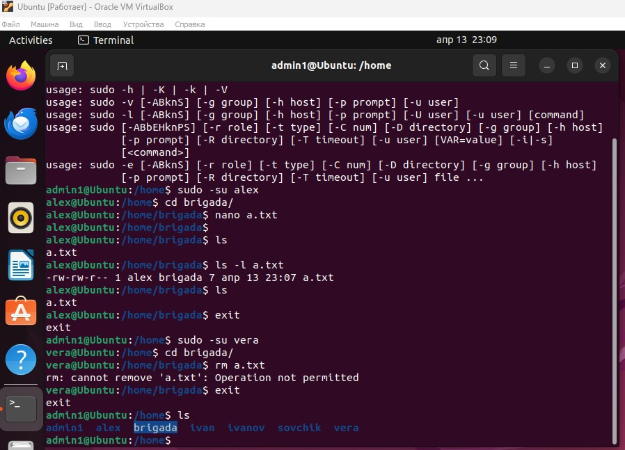
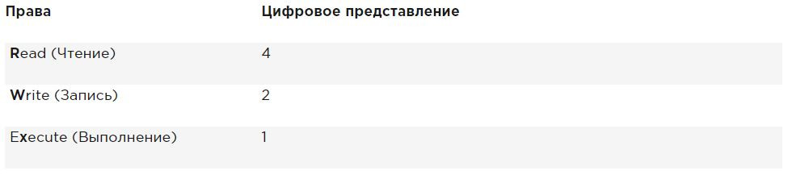

**1. Для каких типов пользователей определяется доступ к файлу?**

Владелец (Owner) — пользователь, который является владельцем файла или каталога.
Группа (Group) — группа пользователей, к которой принадлежит файл или каталог.
Остальные пользователи (Others) — все остальные пользователи системы.

**2. На что, кроме права на запись и права на чтение, могут иметь право пользователи?**

Выполнение (Execute) — обозначается буквой «x». Дает разрешение на выполнение файла или на вход в каталог.

**3. Как определить режим доступа к файлу или каталогу?**

команда ls -l

**4. Опишите действие модификатора доступа Sticky bit на доступ к файлам и каталогам.**

sticky bit - это разрешение для защиты файлов от случайного удаления в среде, где несколько пользователей имеют права на запись в один и тот же каталог. Если применяется закрепленный sticky bit, пользователь может удалить файл, только если он является пользователем-владельцем файла или каталога, в котором содержится файл. По этой причине он применяется в качестве разрешения по умолчанию для каталога /tmp и может быть полезен также для каталогов общих групп.

**5. Опишите действие модификатора доступа SUID на доступ к файлам и каталогам.**

Разрешение на установку идентификатора пользователя (SUID). В некоторых особых случаях вы можете применить это разрешение к исполняемым файлам. По умолчанию пользователь, запускающий исполняемый файл, запускает этот файл со своими собственными разрешениями.

Для обычных пользователей это обычно означает, что использование программы ограничено. Однако в некоторых случаях пользователю требуются специальные разрешения, только для выполнения определенной задачи.

**6. Опишите действие модификатора доступа SGID на доступ к файлам и каталогам.**

SGID - это разрешение имеет два эффекта. При применении к исполняемому файлу, он дает пользователю, который исполняет файл, разрешения владельца группы этого файла. Таким образом, SGID может выполнить более или менее то же самое, что SUID. Однако для этой цели SGID практически не используется.

Как и в случае с разрешением SUID, SGID применяется к некоторым системным файлам в качестве настройки по умолчанию.

Когда применяется к каталогу, SGID может быть полезен, потому что вы можете использовать его для установки владельца группы по умолчанию для файлов и подкаталогов, созданных в этом каталоге. По умолчанию, когда пользователь создает файл, его эффективная первичная группа устанавливается как владелец группы для этого файла.

**7. Для чего и как используется команда chmod? Приведите пример ее использования.**

Для управления правами используется команда chmod. При использовании chmod вы можете устанавливать разрешения для пользователя (user), группы (group) и других (other). Вы можете использовать эту команду в двух режимах: относительный режим и абсолютный режим. В абсолютном режиме три цифры используются для установки основных разрешений.

При настройке разрешений рассчитайте необходимое вам значение. Если вы хотите установить чтение, запись и выполнение для пользователя, чтение и выполнение для группы, а также чтение и выполнение для других в файле /somefile, то вы используете следующую команду chmod:

    chmod 755 /somefile

огда вы используете chmod таким способом, все текущие разрешения заменяются установленными вами разрешениями.

Если вы хотите изменить разрешения относительно текущих разрешений, вы можете использовать chmod в относительном режиме. При использовании chmod в относительном режиме вы работаете с тремя индикаторами, чтобы указать, что вы хотите сделать:

Сначала вы указываете, для кого вы хотите изменить разрешения. Для этого вы можете выбрать между пользователем (u), группой (g) и другими (o).
Затем вы используете оператор для добавления или удаления разрешений из текущего режима или устанавливаете их абсолютно.
В конце вы используете r, w и x, чтобы указать, какие разрешения вы хотите установить.

При изменении разрешений в относительном режиме вы можете пропустить часть «кому», чтобы добавить или удалить разрешение для всех объектов. Например, эта команда добавляет разрешение на выполнение для всех пользователей:

    chmod +x somefile

При работе в относительном режиме вы также можете использовать более сложные команды. Например, эта команда добавляет разрешение на запись в группу и удаляет чтение для других:

    chmod g+w,o-r somefile

При использовании chmod -R o+rx /data вы устанавливаете разрешение на выполнение для всех каталогов, а также для файлов в каталоге /data. Чтобы установить разрешение на выполнение только для каталогов, а не для файлов, используйте chmod -R o+ rX /data.

Верхний регистр X гарантирует, что файлы не получат разрешение на выполнение, если файл уже не установил разрешение на выполнение для некоторых объектов. Это делает X более разумным способом работы с разрешениями на выполнение; это позволит избежать установки этого разрешения на файлы, где оно не требуется.
